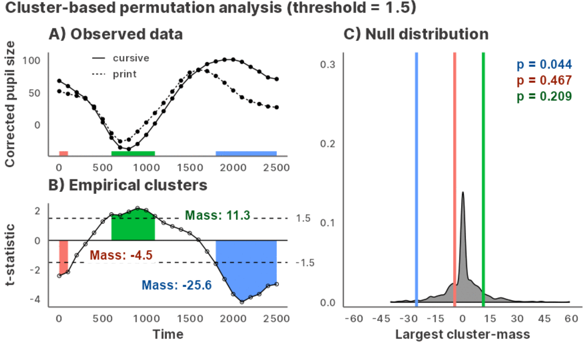

<!-- README.md is generated from README.Rmd. Please edit that file -->

```{r, include = FALSE}
knitr::opts_chunk$set(
  collapse = TRUE,
  comment = "#>",
  fig.path = "man/figures/README-",
  out.width = "75%"
)
```

# jlmerclusterperm <a href="https://yjunechoe.github.io/jlmerclusterperm/"></a>

<!-- badges: start -->
[](https://CRAN.R-project.org/package=jlmerclusterperm)
[](https://github.com/yjunechoe/jlmerclusterperm/actions/workflows/R-CMD-check.yaml)
[](https://github.com/yjunechoe/jlmerclusterperm/actions?query=workflow%3Apkgcheck)
[](https://app.codecov.io/gh/yjunechoe/jlmerclusterperm?branch=main)
[](https://cranlogs.r-pkg.org/badges/grand-total/jlmerclusterperm)
<!-- badges: end -->

Julia [GLM.jl](https://github.com/JuliaStats/GLM.jl) and [MixedModels.jl](https://github.com/JuliaStats/MixedModels.jl) based implementation of the cluster-based permutation test for time series data, powered by [JuliaConnectoR](https://github.com/stefan-m-lenz/JuliaConnectoR).



## Installation and usage

Install the released version of jlmerclusterperm from CRAN:

```{r, eval = FALSE}
install.packages("jlmerclusterperm")
```

Or install the development version from [GitHub](https://github.com/yjunechoe/jlmerclusterperm) with:

```{r, eval = FALSE}
# install.packages("remotes")
remotes::install_github("yjunechoe/jlmerclusterperm")
```

Using `jlmerclusterperm` requires a prior installation of the Julia programming language, which can be downloaded from either the [official website](https://julialang.org/) or using the command line utility [juliaup](https://github.com/JuliaLang/juliaup). Julia version >=1.8 is required and [1.9](https://julialang.org/blog/2023/04/julia-1.9-highlights/#caching_of_native_code) or higher is preferred for the substantial speed improvements.

Before using functions from `jlmerclusterperm`, an initial setup is required via calling `jlmerclusterperm_setup()`. The very first call on a system will install necessary dependencies (this only happens once and takes around 10-15 minutes).

Subsequent calls to `jlmerclusterperm_setup()` incur a small overhead of around 30 seconds, plus slight delays for first-time function calls. You pay up front for start-up and warm-up costs and get blazingly-fast functions from the package.

```{r setup, eval = FALSE}
# Both lines must be run at the start of each new session
library(jlmerclusterperm)
jlmerclusterperm_setup()
```

```{r setup, include = FALSE}
```

See the [Get Started](https://yjunechoe.github.io/jlmerclusterperm/articles/jlmerclusterperm.html) page on the [package website](https://yjunechoe.github.io/jlmerclusterperm/) for background and tutorials.

## Quick tour of package functionalities

### Wholesale CPA with `clusterpermute()`

A time series data:

```{r chickweight, message = FALSE}
chickweights <- ChickWeight
chickweights$Time <- as.integer(factor(chickweights$Time))
matplot(
  tapply(chickweights$weight, chickweights[c("Time", "Diet")], mean),
  type = "b", lwd = 3, ylab = "Weight", xlab = "Time"
)
```

Preparing a specification object with `make_jlmer_spec()`:

```{r chickweights_spec}
chickweights_spec <- make_jlmer_spec(
  formula = weight ~ 1 + Diet,
  data = chickweights,
  subject = "Chick", time = "Time"
)
chickweights_spec
```

Cluster-based permutation test with `clusterpermute()`:

```{r CPA, message = FALSE}
set_rng_state(123L)
clusterpermute(
  chickweights_spec,
  threshold = 2.5,
  nsim = 100
)
```

Including random effects:

```{r chickweights_re_spec, message = FALSE}
chickweights_re_spec <- make_jlmer_spec(
  formula = weight ~ 1 + Diet + (1 | Chick),
  data = chickweights,
  subject = "Chick", time = "Time"
)
set_rng_state(123L)
clusterpermute(
  chickweights_re_spec,
  threshold = 2.5,
  nsim = 100
)$empirical_clusters
```

### Piecemeal approach to CPA

Computing time-wise statistics of the observed data:

```{r empirical_statistics}
empirical_statistics <- compute_timewise_statistics(chickweights_spec)
matplot(t(empirical_statistics), type = "b", pch = 1, lwd = 3, ylab = "t-statistic")
abline(h = 2.5, lty = 3)
```

Identifying empirical clusters:

```{r empirical_clusters}
empirical_clusters <- extract_empirical_clusters(empirical_statistics, threshold = 2.5)
empirical_clusters
```

Simulating the null distribution:

```{r null_statistics}
set_rng_state(123L)
null_statistics <- permute_timewise_statistics(chickweights_spec, nsim = 100)
null_cluster_dists <- extract_null_cluster_dists(null_statistics, threshold = 2.5)
null_cluster_dists
```

Significance testing the cluster-mass statistic:

```{r calculate_clusters_pvalues}
calculate_clusters_pvalues(empirical_clusters, null_cluster_dists, add1 = TRUE)
```

Iterating over a range of threshold values:

```{r walk_threshold_steps, message = FALSE}
walk_threshold_steps(empirical_statistics, null_statistics, steps = c(2, 2.5, 3))
```

## Acknowledgments

- The paper [Maris & Oostenveld (2007)](https://doi.org/10.1016/j.jneumeth.2007.03.024) which originally proposed the cluster-based permutation analysis.

- The [JuliaConnectoR](https://github.com/stefan-m-lenz/JuliaConnectoR) package for powering the R interface to Julia.

- The Julia packages [GLM.jl](https://github.com/JuliaStats/GLM.jl) and [MixedModels.jl](https://github.com/JuliaStats/MixedModels.jl) for fast implementations of (mixed effects) regression models.

- Existing implementations of CPA in R ([permuco](https://jaromilfrossard.github.io/permuco/), [permutes](https://cran.r-project.org/package=permutes), etc.) whose designs inspired the CPA interface in jlmerclusterperm.

## Citations

If you use jlmerclusterperm for cluster-based permutation test with mixed-effects models in your research, please cite one (or more) of the following as you see fit.

To cite jlmerclusterperm:

- Choe, J. (2023). jlmerclusterperm: Cluster-Based Permutation Analysis for Densely Sampled Time Data. R package version `r as.character(utils::packageVersion('jlmerclusterperm'))`. https://cran.r-project.org/package=jlmerclusterperm.

To cite the cluster-based permutation test:

- Maris, E., & Oostenveld, R. (2007). Nonparametric statistical testing of EEG- and MEG-data. _Journal of Neuroscience Methods, 164_, 177–190. doi: 10.1016/j.jneumeth.2007.03.024.

To cite the Julia programming language:

- Bezanson, J., Edelman, A., Karpinski, S., & Shah, V. B. (2017). Julia: A Fresh Approach to Numerical Computing. _SIAM Review, 59_(1), 65–98. doi: 10.1137/141000671.

To cite the GLM.jl and MixedModels.jl Julia libraries, consult their Zenodo pages: 

- GLM: https://doi.org/10.5281/zenodo.3376013
- MixedModels: https://zenodo.org/badge/latestdoi/9106942


```{r close, include = FALSE}
JuliaConnectoR::stopJulia()
```

```{r srr, include = FALSE}
#' @srrstats {G1.0} References Maris & Oostenveld (2007) which originally proposed the cluster-based permutation analysis.
#' @srrstats {G1.1} Package is an improvement over existing implementations in R (mainly in speed and interpretability).
#'  This is explained in the readme and the case study vignettes.
#' @srrstats {G1.2} Lifecycle is active and stable.
#' @srrstats {G1.3} The many moving parts are explained across the readme, the function documentation, and the topics/case study vignettes.
#'  Users are assumed to already have familiarity with (genearlized, mixed-effects) regression to use this package.
#' @srrstats {G1.4} `roxygen2` is used throughout the package.
```
