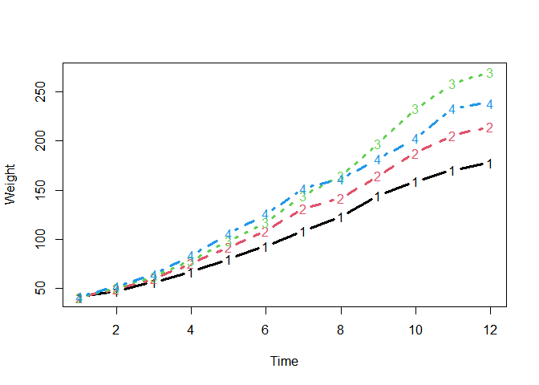
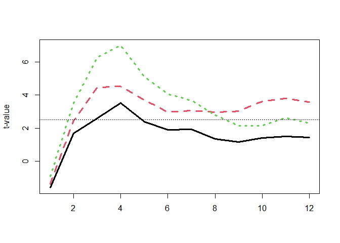

<!-- README.md is generated from README.Rmd. Please edit that file -->

# jlmerclusterperm <a href="https://yjunechoe.github.io/jlmerclusterperm/"></a>

<!-- badges: start -->

[](https://github.com/yjunechoe/jlmerclusterperm)
[](https://github.com/yjunechoe/jlmerclusterperm/actions/workflows/R-CMD-check.yaml)
<!-- badges: end -->

Julia [GLM.jl](https://github.com/JuliaStats/GLM.jl) and
[MixedModels.jl](https://github.com/JuliaStats/MixedModels.jl) based
implementation of bootstrapped cluster-based permutation analysis (CPA)
for time series data, powered by
[JuliaConnectoR](https://github.com/stefan-m-lenz/JuliaConnectoR).


## Installation and usage

You can install the development version of jlmerclusterperm from
[GitHub](https://github.com/yjunechoe/jlmerclusterperm) with:

``` r
# install.packages("remotes")
remotes::install_github("yjunechoe/jlmerclusterperm")
```

Using `jlmerclusterperm` requires a prior installation of Julia, which
can be downloaded from either the [official
website](https://julialang.org/) or using the command line utility
[juliaup](https://github.com/JuliaLang/juliaup). Julia version \>=1.8 is
required and
[1.9](https://julialang.org/blog/2023/04/julia-1.9-highlights/#caching_of_native_code)
is preferred for its substantial speed improvements.

Before using functions from `jlmerclusterperm`, an initial setup step is
required via calling `jlmerclusterperm_setup()`. The very first call on
a system will install necessary dependencies (this only happens once and
takes around 10-15 minutes).

Subsequent calls to `jlmerclusterperm_setup()` incur a small overhead of
around 30 seconds, plus slight delays for first-time function calls. You
pay up front for start-up and warm-up costs and get blazingly-fast
functions from the package.

``` r
# Both lines must be run
library(jlmerclusterperm)
system.time(jlmerclusterperm_setup(verbose = FALSE))
#>    user  system elapsed 
#>    0.00    0.03   25.50
```

See the
[Articles](https://yjunechoe.github.io/jlmerclusterperm/articles/) page
on the [package website](https://github.com/yjunechoe/jlmerclusterperm)
for in-depth tutorials and case study vignettes.

## Quick tour of package functionalities

### Complete CPA with `clusterpermute()`

A time series data:

``` r
chickweights <- ChickWeight
chickweights$Time <- as.integer(factor(chickweights$Time))
matplot(
  tapply(chickweights$weight, chickweights[c("Time", "Diet")], mean),
  type = "b", lwd = 3, ylab = "Weight", xlab = "Time"
)
```



Preparing a specification object:

``` r
chickweights_spec <- make_jlmer_spec(
  formula = weight ~ 1 + Diet,
  data = chickweights,
  subject = "Chick", time = "Time"
)
chickweights_spec
#> ── jlmer specification ───────────────────────────────────────── <jlmer_spec> ──
#> Formula: weight ~ 1 + Diet2 + Diet3 + Diet4
#> Predictors:
#>   Diet: Diet2, Diet3, Diet4
#> Groupings:
#>   Subject: Chick
#>   Trial:
#>   Time: Time
#> Data:
#>   weight Diet2 Diet3 Diet4 Chick Time
#> 1     42     0     0     0     1    1
#> 2     51     0     0     0     1    2
#> 3     59     0     0     0     1    3
#>  [ reached 'max' / getOption("max.print") -- omitted 575 rows ]
#> ────────────────────────────────────────────────────────────────────────────────
```

Cluster-based permutation test:

``` r
set_rng_state(123L)
clusterpermute(
  chickweights_spec,
  threshold = 2.5,
  nsim = 100,
  progress = FALSE
)
#> $null_cluster_dists
#> ── Null cluster-mass distribution (t > 2.5) ──────────── <null_cluster_dists> ──
#> Diet2 (n = 100)
#>   Mean (SD): -0.039 (1.89)
#>   Coverage intervals: 95% [-2.862, 0.000]
#> Diet3 (n = 100)
#>   Mean (SD): -0.129 (2.02)
#>   Coverage intervals: 95% [0.000, 0.000]
#> Diet4 (n = 100)
#>   Mean (SD): 0.296 (3.21)
#>   Coverage intervals: 95% [0.000, 5.797]
#> ────────────────────────────────────────────────────────────────────────────────
#> 
#> $empirical_clusters
#> ── Empirical clusters (t > 2.5) ──────────────────────── <empirical_clusters> ──
#> Diet2
#>   [3, 4]: 6.121 (p=0.0495)
#> Diet3
#>   [3, 12]: 35.769 (p=0.0099)
#> Diet4
#>   [2, 8]: 32.442 (p=0.0099)
#> ────────────────────────────────────────────────────────────────────────────────
```

With random effects:

``` r
chickweights_re_spec <- make_jlmer_spec(
  formula = weight ~ 1 + Diet + (1 | Chick),
  data = chickweights,
  subject = "Chick", time = "Time"
)
set_rng_state(123L)
clusterpermute(
  chickweights_re_spec,
  threshold = 2.5,
  nsim = 100,
  progress = FALSE
)$empirical_clusters
#> ── Empirical clusters (t > 2.5) ──────────────────────── <empirical_clusters> ──
#> Diet2
#>   [3, 4]: 6.387 (p=0.0594)
#> Diet3
#>   [2, 12]: 39.919 (p=0.0099)
#> Diet4
#>   [2, 8]: 33.853 (p=0.0099)
#> ────────────────────────────────────────────────────────────────────────────────
```

### Piecemeal approach to CPA

Computing time-wise statistics of the observed data:

``` r
empirical_statistics <- compute_timewise_statistics(chickweights_spec)
tidy(empirical_statistics)
#>    predictor time statistic
#> 1      Diet2    1 -1.602704
#> 2      Diet3    1 -1.373747
#> 3      Diet4    1 -0.915831
#> 4      Diet2    2  1.670228
#> 5      Diet3    2  2.447078
#> 6      Diet4    2  3.534669
#> 7      Diet2    3  2.600323
#> 8      Diet3    3  4.476505
#> 9      Diet4    3  6.274514
#> 10     Diet2    4  3.520818
#> 11     Diet3    4  4.543060
#> 12     Diet4    4  6.996441
#> 13     Diet2    5  2.375235
#> 14     Diet3    5  3.699665
#> 15     Diet4    5  5.122934
#> 16     Diet2    6  1.909022
#> 17     Diet3    6  2.971831
#> 18     Diet4    6  4.071714
#> 19     Diet2    7  1.943661
#> 20     Diet3    7  3.061704
#> 21     Diet4    7  3.659132
#> 22     Diet2    8  1.341161
#> 23     Diet3    8  2.978569
#> 24     Diet4    8  2.782950
#> 25     Diet2    9  1.157799
#> 26     Diet3    9  3.045802
#> 27     Diet4    9  2.156651
#> 28     Diet2   10  1.396368
#> 29     Diet3   10  3.600737
#> 30     Diet4   10  2.134394
#> 31     Diet2   11  1.512195
#> 32     Diet3   11  3.802734
#> 33     Diet4   11  2.637206
#> 34     Diet2   12  1.432626
#> 35     Diet3   12  3.588349
#> 36     Diet4   12  2.280864
```

``` r
matplot(t(empirical_statistics), type = "b", pch = 1, lwd = 3, ylab = "t-statistic")
abline(h = 2.5, lty = 3)
```



Identifying empirical clusters:

``` r
empirical_clusters <- extract_empirical_clusters(empirical_statistics, threshold = 2.5)
empirical_clusters
#> ── Empirical clusters (t > 2.5) ──────────────────────── <empirical_clusters> ──
#> Diet2
#>   [3, 4]: 6.121
#> Diet3
#>   [3, 12]: 35.769
#> Diet4
#>   [2, 8]: 32.442
#> ────────────────────────────────────────────────────────────────────────────────
```

Simulating the null distribution:

``` r
set_rng_state(123L)
null_statistics <- permute_timewise_statistics(chickweights_spec, nsim = 100)
null_cluster_dists <- extract_null_cluster_dists(null_statistics, threshold = 2.5)
null_cluster_dists
#> ── Null cluster-mass distribution (t > 2.5) ──────────── <null_cluster_dists> ──
#> Diet2 (n = 100)
#>   Mean (SD): -0.039 (1.89)
#>   Coverage intervals: 95% [-2.862, 0.000]
#> Diet3 (n = 100)
#>   Mean (SD): -0.129 (2.02)
#>   Coverage intervals: 95% [0.000, 0.000]
#> Diet4 (n = 100)
#>   Mean (SD): 0.296 (3.21)
#>   Coverage intervals: 95% [0.000, 5.797]
#> ────────────────────────────────────────────────────────────────────────────────
```

Significance testing the cluster-mass statistic:

``` r
calculate_clusters_pvalues(empirical_clusters, null_cluster_dists, add1 = TRUE)
#> ── Empirical clusters (t > 2.5) ──────────────────────── <empirical_clusters> ──
#> Diet2
#>   [3, 4]: 6.121 (p=0.0495)
#> Diet3
#>   [3, 12]: 35.769 (p=0.0099)
#> Diet4
#>   [2, 8]: 32.442 (p=0.0099)
#> ────────────────────────────────────────────────────────────────────────────────
```

Iterating over a range of threshold values:

``` r
walk_threshold_steps(
  empirical_statistics, null_statistics,
  threshold_steps = c(2, 2.5, 3)
)
#>    threshold predictor id start end length sum_statistic     pvalue
#> 1        2.0     Diet2  1     3   5      3      8.496376 0.07920792
#> 2        2.0     Diet3  1     2  12     11     38.216035 0.00990099
#> 3        2.0     Diet4  1     2  12     11     41.651468 0.00990099
#> 4        2.5     Diet2  1     3   4      2      6.121141 0.04950495
#> 5        2.5     Diet3  1     3  12     10     35.768957 0.00990099
#> 6        2.5     Diet4  1     2   8      7     32.442352 0.00990099
#> 31       3.0     Diet3  1     3   5      3     12.719231 0.00990099
#> 21       3.0     Diet3  2     9  12      4     14.037622 0.00990099
#> 41       3.0     Diet4  1     2   7      6     29.659402 0.00990099
```

## Acknowledgements

- The paper [Maris & Oostenveld
  (2007)](https://doi.org/10.1016/j.jneumeth.2007.03.024) which
  originally proposed the cluster-based permutation analysis.

- The [JuliaConnectoR](https://github.com/stefan-m-lenz/JuliaConnectoR)
  package for powering the R interface to Julia.

- The Julia packages [GLM.jl](https://github.com/JuliaStats/GLM.jl) and
  [MixedModels.jl](https://github.com/JuliaStats/MixedModels.jl) for
  fast implementations (mixed effects) regression models.

- Existing implementations of CPA in R
  ([permuco](https://jaromilfrossard.github.io/permuco/),
  [permutes](https://github.com/cvoeten/permutes), etc.) whose designs
  inspired the CPA interface in jlmerclusterperm.
