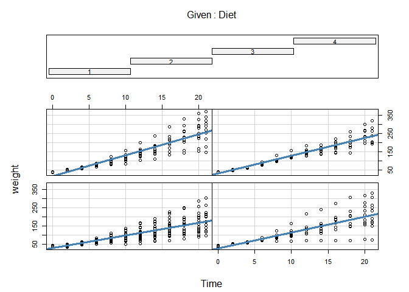

<!-- README.md is generated from README.Rmd. Please edit that file -->

# jlmerclusterperm

<!-- badges: start -->

[](https://lifecycle.r-lib.org/articles/stages.html#experimental)
<!-- badges: end -->

Julia [MixedModels.jl](https://github.com/JuliaStats/MixedModels.jl)
implementation of cluster-based permutation test for time series data,
powered by
[{JuliaConnectoR}](https://github.com/stefan-m-lenz/JuliaConnectoR)

## Installation

You can install the development version of jlmerclusterperm from
[GitHub](https://github.com/) with:

``` r
# install.packages("devtools")
devtools::install_github("yjunechoe/jlmerclusterperm")
```

## Setup

``` r
library(jlmerclusterperm)
system.time({jlmerclusterperm_setup()})
#> Starting Julia with 7 workers ...
#> Running package setup scripts ...
#>    user  system elapsed 
#>    0.04    0.03   27.36
```

## Basic example

Example data:

``` r
chickweight_df <- as.data.frame(ChickWeight)
fm <- weight ~ 1 + Diet + (1 | Chick)
coplot(
  formula = weight ~ Time | Diet,
  data = chickweight_df,
  panel = function(x, y, ...) {
    points(x, y, ...)
    abline(lm(y ~ x), col = "steelblue", lwd = 3)
  }
)
```



Run Julia mixed model using lme4 syntax, using the convenience form
`to_jlmer()`:

``` r
library(lme4)
#> Loading required package: Matrix
summary(lmer(fm, chickweight_df))
#> Linear mixed model fit by REML ['lmerMod']
#> Formula: weight ~ 1 + Diet + (1 | Chick)
#>    Data: chickweight_df
#> 
#> REML criterion at convergence: 6506.8
#> 
#> Scaled residuals: 
#>     Min      1Q  Median      3Q     Max 
#> -1.8495 -0.7499 -0.1835  0.6363  3.0852 
#> 
#> Random effects:
#>  Groups   Name        Variance Std.Dev.
#>  Chick    (Intercept)  305.8   17.49   
#>  Residual             4526.6   67.28   
#> Number of obs: 578, groups:  Chick, 50
#> 
#> Fixed effects:
#>             Estimate Std. Error t value
#> (Intercept)   101.63       6.04  16.826
#> Diet2          20.98      10.24   2.050
#> Diet3          41.32      10.24   4.036
#> Diet4          33.40      10.27   3.253
#> 
#> Correlation of Fixed Effects:
#>       (Intr) Diet2  Diet3 
#> Diet2 -0.590              
#> Diet3 -0.590  0.348       
#> Diet4 -0.588  0.347  0.347

to_jlmer(fm, chickweight_df)
#> <Julia object of type LinearMixedModel{Float64}>
#> Linear mixed model fit by maximum likelihood
#>  weight ~ 1 + Diet2 + Diet3 + Diet4 + (1 | Chick)
#>    logLik   -2 logLik     AIC       AICc        BIC    
#>  -3265.1439  6530.2877  6542.2877  6542.4348  6568.4452
#> 
#> Variance components:
#>             Column    Variance Std.Dev.
#> Chick    (Intercept)   247.2559 15.7244
#> Residual              4527.9661 67.2902
#>  Number of obs: 578; levels of grouping factors: 50
#> 
#>   Fixed-effects parameters:
#> ──────────────────────────────────────────────────
#>                 Coef.  Std. Error      z  Pr(>|z|)
#> ──────────────────────────────────────────────────
#> (Intercept)  101.781      5.78499  17.59    <1e-68
#> Diet2         20.8353     9.79412   2.13    0.0334
#> Diet3         41.1687     9.79412   4.20    <1e-04
#> Diet4         33.284      9.82881   3.39    0.0007
#> ──────────────────────────────────────────────────
```

Run Julia mixed model directly in `jlmer()` after explicitly
reformulating with `jlmer_model_matrix()`:

``` r
mm <- jlmer_model_matrix(fm, chickweight_df, cols_keep = "Time")
jlmer(mm$julia_formula, mm$data)
#> <Julia object of type LinearMixedModel{Float64}>
#> Linear mixed model fit by maximum likelihood
#>  weight ~ 1 + Diet2 + Diet3 + Diet4 + (1 | Chick)
#>    logLik   -2 logLik     AIC       AICc        BIC    
#>  -3265.1439  6530.2877  6542.2877  6542.4348  6568.4452
#> 
#> Variance components:
#>             Column    Variance Std.Dev.
#> Chick    (Intercept)   247.2559 15.7244
#> Residual              4527.9661 67.2902
#>  Number of obs: 578; levels of grouping factors: 50
#> 
#>   Fixed-effects parameters:
#> ──────────────────────────────────────────────────
#>                 Coef.  Std. Error      z  Pr(>|z|)
#> ──────────────────────────────────────────────────
#> (Intercept)  101.781      5.78499  17.59    <1e-68
#> Diet2         20.8353     9.79412   2.13    0.0334
#> Diet3         41.1687     9.79412   4.20    <1e-04
#> Diet4         33.284      9.82881   3.39    0.0007
#> ──────────────────────────────────────────────────
```

Fit jlmer at each timepoint and get a z-matrix back with
`jlmer_by_time`:

``` r
jlmer_by_time(mm$julia_formula, mm$data, time = "Time")
#>              Time
#> Predictors              0         2         4         6         8        10
#>   (Intercept) 171.1679337 66.283563 78.451405 48.530261 27.990931 20.435061
#>   Diet2        -1.6709347  1.741333  2.713433  3.673967  2.478554  1.992062
#>   Diet3        -1.4322297  2.551256  4.671226  4.740676  3.860595  3.101100
#>   Diet4        -0.9548198  3.685147  6.547445  7.300775  5.345773  4.248827
#>              Time
#> Predictors           12        14        16        18        20        21
#>   (Intercept) 16.459364 15.624203 14.347003 13.257500 12.593491 11.642034
#>   Diet2        2.028207  1.400797  1.210453  1.459871  1.582567  1.500884
#>   Diet3        3.194883  3.111014  3.184318  3.764490  3.979699  3.759318
#>   Diet4        3.818298  2.906696  2.254730  2.231461  2.759932  2.389537
```

Fit logistic regression to each time point (produces Inf/-Inf when
response vector is a constant 1/0):

``` r
data_binom <- transform(mm$data, weight = as.integer(weight > median(weight)))
jlmer_by_time(mm$julia_formula, data_binom, time = "Time", family = "binomial")
#>              Time
#> Predictors       0    2    4    6          8            10           12
#>   (Intercept) -Inf -Inf -Inf -Inf -2.8132693 -1.976258e+00 2.292998e-01
#>   Diet2       -Inf -Inf -Inf -Inf  0.4708979  1.256523e+00 1.819167e+00
#>   Diet3       -Inf -Inf -Inf -Inf  1.6507716  2.551637e+00 1.819167e+00
#>   Diet4       -Inf -Inf -Inf -Inf  2.0479509  7.195493e-17 8.144874e-16
#>              Time
#> Predictors              14           16           18           20           21
#>   (Intercept) 9.348156e-01 2.061280e+00 2.676552e+00 2.676552e+00 2.574118e+00
#>   Diet2       1.504909e+00 8.493557e-01 1.407529e-01 1.407529e-01 1.937416e-01
#>   Diet3       1.877299e-16 6.413878e-14 3.427547e-15 3.427547e-15 3.430677e-15
#>   Diet4       1.877299e-16 6.413878e-14 3.427547e-15 3.251656e-15 3.254626e-15
```

## Formula utilities

``` r
jlmer_model_matrix(mpg ~ wt * qsec + (1 + wt | vs), head(mtcars))
#> $formula
#> mpg ~ 1 + wt + qsec + wt__qsec + (1 + wt | vs)
#> <environment: 0x00000178aae06d88>
#> 
#> $julia_formula
#> mpg ~ 1 + wt + qsec + wt__qsec + (1 + wt | vs)
#> <environment: 0x00000178aae06d88>
#> 
#> $data
#>                    mpg    wt  qsec wt__qsec vs
#> Mazda RX4         21.0 2.620 16.46  43.1252  0
#> Mazda RX4 Wag     21.0 2.875 17.02  48.9325  0
#> Datsun 710        22.8 2.320 18.61  43.1752  1
#> Hornet 4 Drive    21.4 3.215 19.44  62.4996  1
#> Hornet Sportabout 18.7 3.440 17.02  58.5488  0
#> Valiant           18.1 3.460 20.22  69.9612  1
jlmer_model_matrix(mpg ~ wt * qsec + (1 + wt || vs), head(mtcars))
#> $formula
#> mpg ~ 1 + wt + qsec + wt__qsec + (1 + wt || vs)
#> <environment: 0x00000178aae06d88>
#> 
#> $julia_formula
#> mpg ~ 1 + wt + qsec + wt__qsec + zerocorr(1 + wt | vs)
#> <environment: 0x00000178aae06d88>
#> 
#> $data
#>                    mpg    wt  qsec wt__qsec vs
#> Mazda RX4         21.0 2.620 16.46  43.1252  0
#> Mazda RX4 Wag     21.0 2.875 17.02  48.9325  0
#> Datsun 710        22.8 2.320 18.61  43.1752  1
#> Hornet 4 Drive    21.4 3.215 19.44  62.4996  1
#> Hornet Sportabout 18.7 3.440 17.02  58.5488  0
#> Valiant           18.1 3.460 20.22  69.9612  1
jlmer_model_matrix(mpg ~ wt * qsec + (1 + wt | vs), head(mtcars), drop_terms = "wt__qsec")
#> $formula
#> mpg ~ 1 + wt + qsec + (1 + wt | vs)
#> <environment: 0x00000178aae06d88>
#> 
#> $julia_formula
#> mpg ~ 1 + wt + qsec + (1 + wt | vs)
#> <environment: 0x00000178aae06d88>
#> 
#> $data
#>                    mpg    wt  qsec vs
#> Mazda RX4         21.0 2.620 16.46  0
#> Mazda RX4 Wag     21.0 2.875 17.02  0
#> Datsun 710        22.8 2.320 18.61  1
#> Hornet 4 Drive    21.4 3.215 19.44  1
#> Hornet Sportabout 18.7 3.440 17.02  0
#> Valiant           18.1 3.460 20.22  1
jlmer_model_matrix(mpg ~ wt * qsec + (1 + wt | vs), head(mtcars), cols_keep = TRUE)
#> $formula
#> mpg ~ 1 + wt + qsec + wt__qsec + (1 + wt | vs)
#> <environment: 0x00000178aae06d88>
#> 
#> $julia_formula
#> mpg ~ 1 + wt + qsec + wt__qsec + (1 + wt | vs)
#> <environment: 0x00000178aae06d88>
#> 
#> $data
#>                    mpg    wt  qsec wt__qsec vs cyl disp  hp drat am gear carb
#> Mazda RX4         21.0 2.620 16.46  43.1252  0   6  160 110 3.90  1    4    4
#> Mazda RX4 Wag     21.0 2.875 17.02  48.9325  0   6  160 110 3.90  1    4    4
#> Datsun 710        22.8 2.320 18.61  43.1752  1   4  108  93 3.85  1    4    1
#> Hornet 4 Drive    21.4 3.215 19.44  62.4996  1   6  258 110 3.08  0    3    1
#> Hornet Sportabout 18.7 3.440 17.02  58.5488  0   8  360 175 3.15  0    3    2
#> Valiant           18.1 3.460 20.22  69.9612  1   6  225 105 2.76  0    3    1
```
