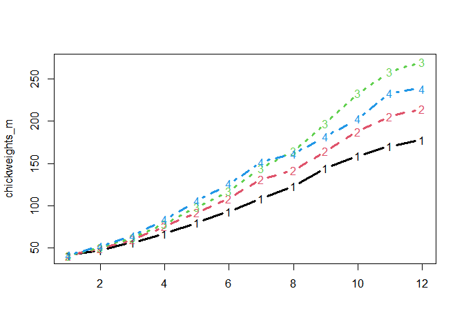

<!-- README.md is generated from README.Rmd. Please edit that file -->

# jlmerclusterperm

<!-- badges: start -->

[](https://lifecycle.r-lib.org/articles/stages.html#experimental)
<!-- badges: end -->

Julia [MixedModels.jl](https://github.com/JuliaStats/MixedModels.jl)
implementation of cluster-based permutation test for time series data,
powered by
[{JuliaConnectoR}](https://github.com/stefan-m-lenz/JuliaConnectoR)

## Installation

You can install the development version of jlmerclusterperm from
[GitHub](https://github.com/yjunechoe/jlmerclusterperm) with:

``` r
# install.packages("remotes")
remotes::install_github("yjunechoe/jlmerclusterperm")
```

## Setup

``` r
# library(jlmerclusterperm)
# system.time({jlmerclusterperm_setup()})
```

## Basic example

Example data:

``` r
head(ChickWeight)
#>   weight Time Chick Diet
#> 1     42    0     1    1
#> 2     51    2     1    1
#> 3     59    4     1    1
#> 4     64    6     1    1
#> 5     76    8     1    1
#> 6     93   10     1    1
fm <- weight ~ 1 + Diet + (1 | Chick)
```

``` r
chickweights_m <- tapply(ChickWeight$weight, ChickWeight[c("Time", "Diet")], mean)
matplot(chickweights_m, type = "b", lwd = 3)
```



WIP
