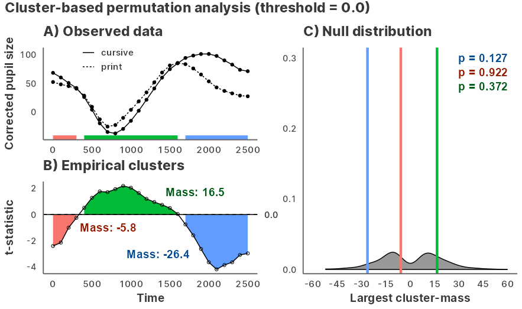
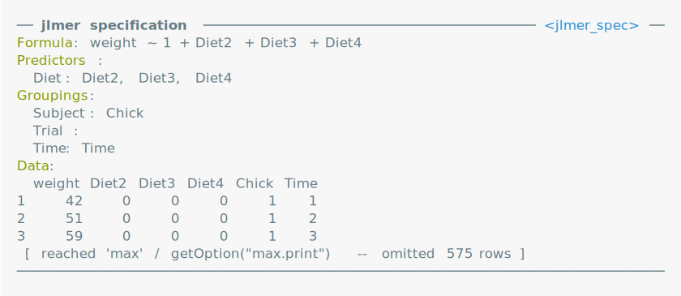
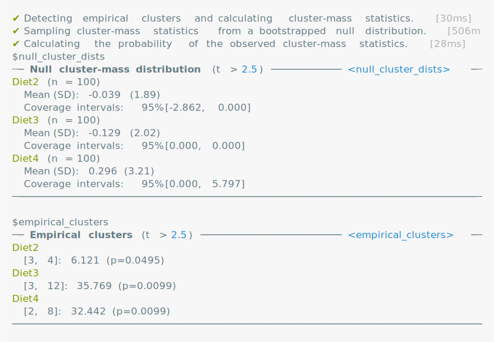
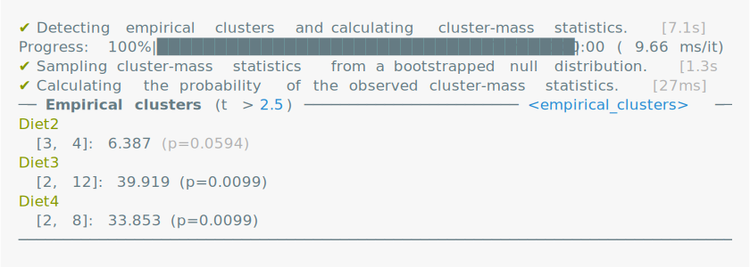
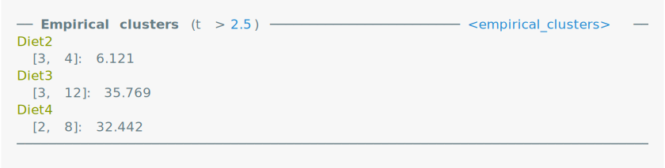
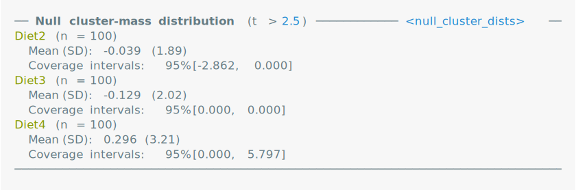
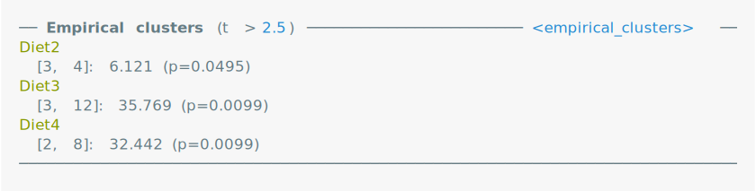
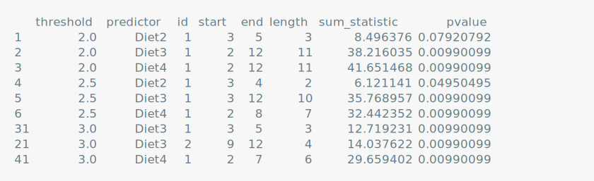

<!-- README.md is generated from README.Rmd. Please edit that file -->

# jlmerclusterperm <a href="https://yjunechoe.github.io/jlmerclusterperm/"></a>

<!-- badges: start -->

[](https://CRAN.R-project.org/package=jlmerclusterperm)
[](https://yjunechoe.r-universe.dev/jlmerclusterperm)
[](https://github.com/yjunechoe/jlmerclusterperm/actions/workflows/R-CMD-check.yaml)
[](https://github.com/yjunechoe/jlmerclusterperm/actions?query=workflow%3Apkgcheck)
[](https://app.codecov.io/gh/yjunechoe/jlmerclusterperm?branch=main)
[](https://cranlogs.r-pkg.org/badges/grand-total/jlmerclusterperm)
<!-- badges: end -->

Julia [GLM.jl](https://github.com/JuliaStats/GLM.jl) and
[MixedModels.jl](https://github.com/JuliaStats/MixedModels.jl) based
implementation of the cluster-based permutation test for time series
data, powered by
[JuliaConnectoR](https://github.com/stefan-m-lenz/JuliaConnectoR).



## Installation and usage

### Zero-setup test drive

As of March 2025, **Google Colab** supports Julia. This means `{jlmerclusterperm}`
*just works* out of the box. Try it out in a
[demo notebook](https://colab.research.google.com/drive/1pTXGbuoQKka5Tm8qnyaHrMHs0Z-ALD7k?usp=sharing)
that runs some of the code from the
[Ito et al. 2018 case study vignette](https://yjunechoe.github.io/jlmerclusterperm/articles/Ito-et-al-2018.html).

### Local setup

Install the released version of jlmerclusterperm from CRAN:

``` r
install.packages("jlmerclusterperm")
```

Or install the development version from
[GitHub](https://github.com/yjunechoe/jlmerclusterperm) with:

``` r
# install.packages("remotes")
remotes::install_github("yjunechoe/jlmerclusterperm")
```

Using `jlmerclusterperm` requires a prior installation of the Julia
programming language, which can be downloaded from either the [official
website](https://julialang.org/) or using the command line utility
[juliaup](https://github.com/JuliaLang/juliaup). Julia version \>=1.8 is
required and
[1.9](https://julialang.org/blog/2023/04/julia-1.9-highlights/#caching_of_native_code)
or higher is preferred for the substantial speed improvements.

Before using functions from `jlmerclusterperm`, an initial setup is
required via calling `jlmerclusterperm_setup()`. The very first call on
a system will install necessary dependencies (this only happens once and
takes around 10-15 minutes).

Subsequent calls to `jlmerclusterperm_setup()` incur a small overhead of
around 30 seconds, plus slight delays for first-time function calls. You
pay up front for start-up and warm-up costs and get blazingly-fast
functions from the package.

``` r
# Both lines must be run at the start of each new session
library(jlmerclusterperm)
jlmerclusterperm_setup()
```

<picture>
<source media="(prefers-color-scheme: dark)" srcset="man/figures/README-/setup-io-dark.svg">

</picture>

See the [Get
Started](https://yjunechoe.github.io/jlmerclusterperm/articles/jlmerclusterperm.html)
page on the [package
website](https://yjunechoe.github.io/jlmerclusterperm/) for background
and tutorials.

## Quick tour of package functionalities

### Wholesale CPA with `clusterpermute()`

A time series data:

``` r
chickweights <- ChickWeight
chickweights$Time <- as.integer(factor(chickweights$Time))
matplot(
  tapply(chickweights$weight, chickweights[c("Time", "Diet")], mean),
  type = "b", lwd = 3, ylab = "Weight", xlab = "Time"
)
```


Preparing a specification object with `make_jlmer_spec()`:

``` r
chickweights_spec <- make_jlmer_spec(
  formula = weight ~ 1 + Diet,
  data = chickweights,
  subject = "Chick", time = "Time"
)
chickweights_spec
```

<picture>
<source media="(prefers-color-scheme: dark)" srcset="man/figures/README-/spec-io-dark.svg">

</picture>

Cluster-based permutation test with `clusterpermute()`:

``` r
set_rng_state(123L)
clusterpermute(
  chickweights_spec,
  threshold = 2.5,
  nsim = 100
)
```

<picture>
<source media="(prefers-color-scheme: dark)" srcset="man/figures/README-/CPA-io-dark.svg">

</picture>

Including random effects:

``` r
chickweights_re_spec <- make_jlmer_spec(
  formula = weight ~ 1 + Diet + (1 | Chick),
  data = chickweights,
  subject = "Chick", time = "Time"
)
set_rng_state(123L)
clusterpermute(
  chickweights_re_spec,
  threshold = 2.5,
  nsim = 100
)$empirical_clusters
```

<picture>
<source media="(prefers-color-scheme: dark)" srcset="man/figures/README-/reCPA-io-dark.svg">

</picture>

### Piecemeal approach to CPA

Computing time-wise statistics of the observed data:

``` r
empirical_statistics <- compute_timewise_statistics(chickweights_spec)
matplot(t(empirical_statistics), type = "b", pch = 1, lwd = 3, ylab = "t-statistic")
abline(h = 2.5, lty = 3)
```


Identifying empirical clusters:

``` r
empirical_clusters <- extract_empirical_clusters(empirical_statistics, threshold = 2.5)
empirical_clusters
```

<picture>
<source media="(prefers-color-scheme: dark)" srcset="man/figures/README-/empirical_clusters-dark.svg">

</picture>

Simulating the null distribution:

``` r
set_rng_state(123L)
null_statistics <- permute_timewise_statistics(chickweights_spec, nsim = 100)
null_cluster_dists <- extract_null_cluster_dists(null_statistics, threshold = 2.5)
null_cluster_dists
```

<picture>
<source media="(prefers-color-scheme: dark)" srcset="man/figures/README-/null_statistics-dark.svg">

</picture>

Significance testing the cluster-mass statistic:

``` r
calculate_clusters_pvalues(empirical_clusters, null_cluster_dists, add1 = TRUE)
```

<picture>
<source media="(prefers-color-scheme: dark)" srcset="man/figures/README-/calculate_clusters_pvalues-dark.svg">

</picture>

Iterating over a range of threshold values:

``` r
walk_threshold_steps(empirical_statistics, null_statistics, steps = c(2, 2.5, 3))
```

<picture>
<source media="(prefers-color-scheme: dark)" srcset="man/figures/README-/walk_threshold_steps-dark.svg">

</picture>

## Acknowledgments

- The paper [Maris & Oostenveld
  (2007)](https://doi.org/10.1016/j.jneumeth.2007.03.024) which
  originally proposed the cluster-based permutation analysis.

- The [JuliaConnectoR](https://github.com/stefan-m-lenz/JuliaConnectoR)
  package for powering the R interface to Julia.

- The Julia packages [GLM.jl](https://github.com/JuliaStats/GLM.jl) and
  [MixedModels.jl](https://github.com/JuliaStats/MixedModels.jl) for
  fast implementations of (mixed effects) regression models.

- Existing implementations of CPA in R
  ([permuco](https://jaromilfrossard.github.io/permuco/),
  [permutes](https://cran.r-project.org/package=permutes), etc.) whose
  designs inspired the CPA interface in jlmerclusterperm.

## Citations

If you use jlmerclusterperm for cluster-based permutation test with
mixed-effects models in your research, please cite one (or more) of the
following as you see fit.

To cite jlmerclusterperm:

- Choe, J. (2024). jlmerclusterperm: Cluster-Based
  Permutation Analysis for Densely Sampled Time Data. R package version
  1.1.4.
  [10.32614/CRAN.package.jlmerclusterperm](https://doi.org/10.32614/CRAN.package.jlmerclusterperm).

To cite the cluster-based permutation test:

- Maris, E., & Oostenveld, R. (2007). Nonparametric statistical testing
  of EEG- and MEG-data. *Journal of Neuroscience Methods, 164*, 177–190.
  doi: 10.1016/j.jneumeth.2007.03.024.

To cite the Julia programming language:

- Bezanson, J., Edelman, A., Karpinski, S., & Shah, V. B. (2017). Julia:
  A Fresh Approach to Numerical Computing. *SIAM Review, 59*(1), 65–98.
  doi: 10.1137/141000671.

To cite the GLM.jl and MixedModels.jl Julia libraries, consult their
Zenodo pages:

- GLM: <https://doi.org/10.5281/zenodo.3376013>
- MixedModels: <https://zenodo.org/badge/latestdoi/9106942>
