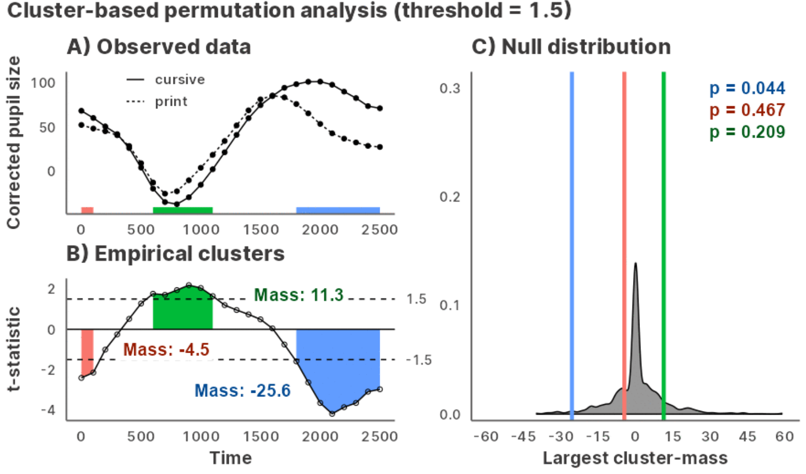

<!-- README.md is generated from README.Rmd. Please edit that file -->

# jlmerclusterperm <a href="https://yjunechoe.github.io/jlmerclusterperm/"></a>

<!-- badges: start -->

[](https://github.com/yjunechoe/jlmerclusterperm)
[](https://github.com/yjunechoe/jlmerclusterperm/actions/workflows/R-CMD-check.yaml)
<!-- badges: end -->

Julia [GLM.jl](https://github.com/JuliaStats/GLM.jl) and
[MixedModels.jl](https://github.com/JuliaStats/MixedModels.jl) based
implementation of cluster-based permutation analysis for time series
data, powered by
[JuliaConnectoR](https://github.com/stefan-m-lenz/JuliaConnectoR).



## Overview

**Cluster-based permutation analysis (CPA)** is a simulation-based,
non-parametric statistical test of difference between groups in a time
series. It is suitable for analyzing **densely-sampled time data**
(e.g., eye gaze, EEG) when the research hypothesis is often specified up
to the existence of an effect (e.g., as predicted by higher-order
cognitive mechanisms) but agnostic to the structural details of the
temporal event (e.g., the precise moment of an effect’s emergence).

CPA formalizes two intuitions about what it means for there to be a
difference between groups:

1)  The countable unit of difference (i.e., a **cluster**) is a
    contiguous, uninterrupted span of *sufficiently large* differences
    at each time point (determined via a pre-determined threshold).

2)  The degree of extremity of a cluster (i.e., the **cluster-mass
    statistic**) is a measure that is sensitive to the magnitude of the
    difference, its variability, and the sample size (e.g., the
    t-statistic from a regression).

In short, the CPA procedure identifies empirical clusters in a time
series and tests the significance of the cluster-mass statistics against
bootstrapped permutations of the data simulating the null.

`jlmerclusterperm` is an interface to a regression-based CPA which
supports both wholesale and piecemeal approaches to conducting a CPA.
See the
[Articles](https://yjunechoe.github.io/jlmerclusterperm/articles/) page
on the [package website](https://github.com/yjunechoe/jlmerclusterperm)
for tutorials and case studies.

## Installation and usage

You can install the development version of jlmerclusterperm from
[GitHub](https://github.com/yjunechoe/jlmerclusterperm) with:

``` r
# install.packages("remotes")
remotes::install_github("yjunechoe/jlmerclusterperm")
```

Using `jlmerclusterperm` requires a prior installation of Julia, which
can be downloaded from either the [official
website](https://julialang.org/) or using the command line utility
[juliaup](https://github.com/JuliaLang/juliaup). Julia version \>=1.8 is
required and
[1.9](https://julialang.org/blog/2023/04/julia-1.9-highlights/#caching_of_native_code)
is preferred for its substantial speed improvements.

Before using functions from `jlmerclusterperm`, an initial setup is
required via calling `jlmerclusterperm_setup()`. The very first call on
a system will install necessary dependencies (this only happens once and
takes around 10-15 minutes).

Subsequent calls to `jlmerclusterperm_setup()` incur a small overhead of
around 30 seconds, plus slight delays for first-time function calls. You
pay up front for start-up and warm-up costs and get blazingly-fast
functions from the package.

``` r
# Both lines must be run at the start of each new session
library(jlmerclusterperm)
system.time(jlmerclusterperm_setup(verbose = FALSE))
#>    user  system elapsed 
#>    0.03    0.02   23.32
```

## Quick tour of package functionalities

### Wholesale CPA with `clusterpermute()`

A time series data:

``` r
chickweights <- ChickWeight
chickweights$Time <- as.integer(factor(chickweights$Time))
matplot(
  tapply(chickweights$weight, chickweights[c("Time", "Diet")], mean),
  type = "b", lwd = 3, ylab = "Weight", xlab = "Time"
)
```


Preparing a specification object:

``` r
chickweights_spec <- make_jlmer_spec(
  formula = weight ~ 1 + Diet,
  data = chickweights,
  subject = "Chick", time = "Time"
)
chickweights_spec
#> ── jlmer specification ───────────────────────────────────────── <jlmer_spec> ──
#> Formula: weight ~ 1 + Diet2 + Diet3 + Diet4
#> Predictors:
#>   Diet: Diet2, Diet3, Diet4
#> Groupings:
#>   Subject: Chick
#>   Trial:
#>   Time: Time
#> Data:
#>   weight Diet2 Diet3 Diet4 Chick Time
#> 1     42     0     0     0     1    1
#> 2     51     0     0     0     1    2
#> 3     59     0     0     0     1    3
#>  [ reached 'max' / getOption("max.print") -- omitted 575 rows ]
#> ────────────────────────────────────────────────────────────────────────────────
```

Cluster-based permutation test:

``` r
set_rng_state(123L)
clusterpermute(
  chickweights_spec,
  threshold = 2.5,
  nsim = 100,
  progress = FALSE
)
#> $null_cluster_dists
#> ── Null cluster-mass distribution (t > 2.5) ──────────── <null_cluster_dists> ──
#> Diet2 (n = 100)
#>   Mean (SD): -0.039 (1.89)
#>   Coverage intervals: 95% [-2.862, 0.000]
#> Diet3 (n = 100)
#>   Mean (SD): -0.129 (2.02)
#>   Coverage intervals: 95% [0.000, 0.000]
#> Diet4 (n = 100)
#>   Mean (SD): 0.296 (3.21)
#>   Coverage intervals: 95% [0.000, 5.797]
#> ────────────────────────────────────────────────────────────────────────────────
#> 
#> $empirical_clusters
#> ── Empirical clusters (t > 2.5) ──────────────────────── <empirical_clusters> ──
#> Diet2
#>   [3, 4]: 6.121 (p=0.0495)
#> Diet3
#>   [3, 12]: 35.769 (p=0.0099)
#> Diet4
#>   [2, 8]: 32.442 (p=0.0099)
#> ────────────────────────────────────────────────────────────────────────────────
```

With random effects:

``` r
chickweights_re_spec <- make_jlmer_spec(
  formula = weight ~ 1 + Diet + (1 | Chick),
  data = chickweights,
  subject = "Chick", time = "Time"
)
set_rng_state(123L)
clusterpermute(
  chickweights_re_spec,
  threshold = 2.5,
  nsim = 100,
  progress = FALSE
)$empirical_clusters
#> ── Empirical clusters (t > 2.5) ──────────────────────── <empirical_clusters> ──
#> Diet2
#>   [3, 4]: 6.387 (p=0.0594)
#> Diet3
#>   [2, 12]: 39.919 (p=0.0099)
#> Diet4
#>   [2, 8]: 33.853 (p=0.0099)
#> ────────────────────────────────────────────────────────────────────────────────
```

### Piecemeal approach to CPA

Computing time-wise statistics of the observed data:

``` r
empirical_statistics <- compute_timewise_statistics(chickweights_spec)
matplot(t(empirical_statistics), type = "b", pch = 1, lwd = 3, ylab = "t-statistic")
abline(h = 2.5, lty = 3)
```


Identifying empirical clusters:

``` r
empirical_clusters <- extract_empirical_clusters(empirical_statistics, threshold = 2.5)
empirical_clusters
#> ── Empirical clusters (t > 2.5) ──────────────────────── <empirical_clusters> ──
#> Diet2
#>   [3, 4]: 6.121
#> Diet3
#>   [3, 12]: 35.769
#> Diet4
#>   [2, 8]: 32.442
#> ────────────────────────────────────────────────────────────────────────────────
```

Simulating the null distribution:

``` r
set_rng_state(123L)
null_statistics <- permute_timewise_statistics(chickweights_spec, nsim = 100)
null_cluster_dists <- extract_null_cluster_dists(null_statistics, threshold = 2.5)
null_cluster_dists
#> ── Null cluster-mass distribution (t > 2.5) ──────────── <null_cluster_dists> ──
#> Diet2 (n = 100)
#>   Mean (SD): -0.039 (1.89)
#>   Coverage intervals: 95% [-2.862, 0.000]
#> Diet3 (n = 100)
#>   Mean (SD): -0.129 (2.02)
#>   Coverage intervals: 95% [0.000, 0.000]
#> Diet4 (n = 100)
#>   Mean (SD): 0.296 (3.21)
#>   Coverage intervals: 95% [0.000, 5.797]
#> ────────────────────────────────────────────────────────────────────────────────
```

Significance testing the cluster-mass statistic:

``` r
calculate_clusters_pvalues(empirical_clusters, null_cluster_dists, add1 = TRUE)
#> ── Empirical clusters (t > 2.5) ──────────────────────── <empirical_clusters> ──
#> Diet2
#>   [3, 4]: 6.121 (p=0.0495)
#> Diet3
#>   [3, 12]: 35.769 (p=0.0099)
#> Diet4
#>   [2, 8]: 32.442 (p=0.0099)
#> ────────────────────────────────────────────────────────────────────────────────
```

Iterating over a range of threshold values:

``` r
walk_threshold_steps(empirical_statistics, null_statistics, steps = c(2, 2.5, 3))
#>    threshold predictor id start end length sum_statistic     pvalue
#> 1        2.0     Diet2  1     3   5      3      8.496376 0.07920792
#> 2        2.0     Diet3  1     2  12     11     38.216035 0.00990099
#> 3        2.0     Diet4  1     2  12     11     41.651468 0.00990099
#> 4        2.5     Diet2  1     3   4      2      6.121141 0.04950495
#> 5        2.5     Diet3  1     3  12     10     35.768957 0.00990099
#> 6        2.5     Diet4  1     2   8      7     32.442352 0.00990099
#> 31       3.0     Diet3  1     3   5      3     12.719231 0.00990099
#> 21       3.0     Diet3  2     9  12      4     14.037622 0.00990099
#> 41       3.0     Diet4  1     2   7      6     29.659402 0.00990099
```

## Acknowledgements

- The paper [Maris & Oostenveld
  (2007)](https://doi.org/10.1016/j.jneumeth.2007.03.024) which
  originally proposed the cluster-based permutation analysis.

- The [JuliaConnectoR](https://github.com/stefan-m-lenz/JuliaConnectoR)
  package for powering the R interface to Julia.

- The Julia packages [GLM.jl](https://github.com/JuliaStats/GLM.jl) and
  [MixedModels.jl](https://github.com/JuliaStats/MixedModels.jl) for
  fast implementations (mixed effects) regression models.

- Existing implementations of CPA in R
  ([permuco](https://jaromilfrossard.github.io/permuco/),
  [permutes](https://github.com/cvoeten/permutes), etc.) whose designs
  inspired the CPA interface in jlmerclusterperm.
